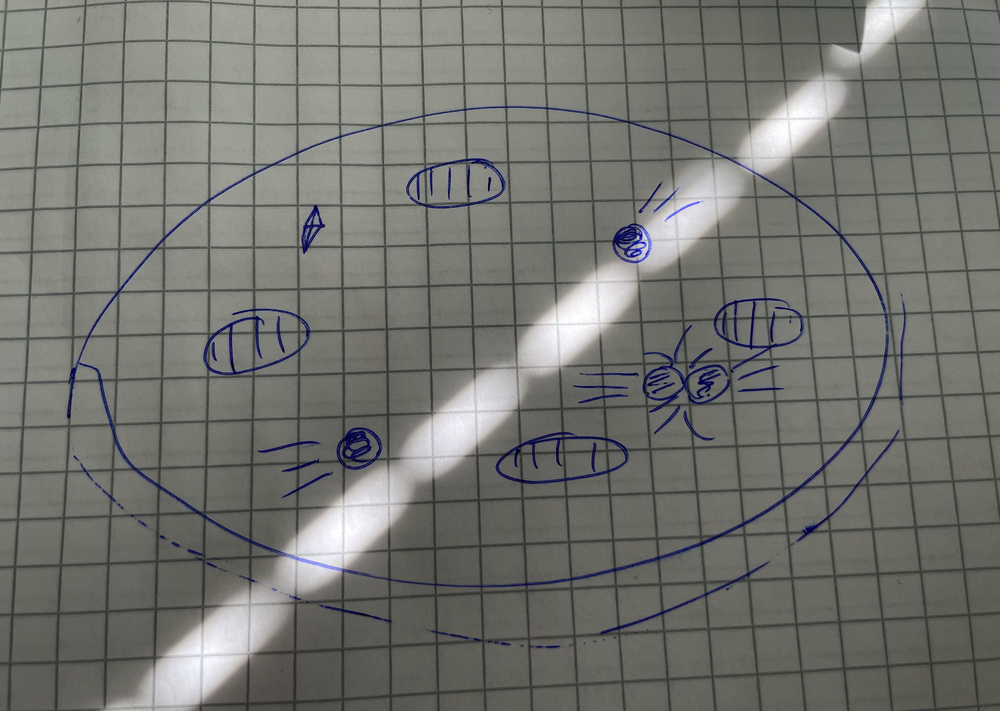
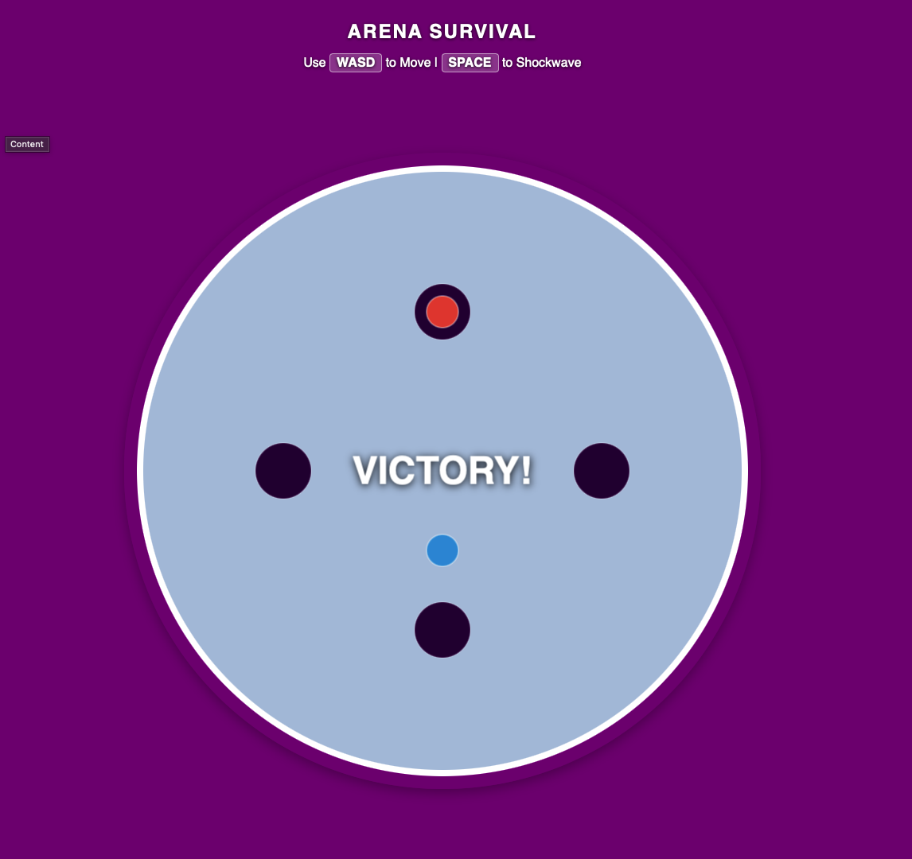
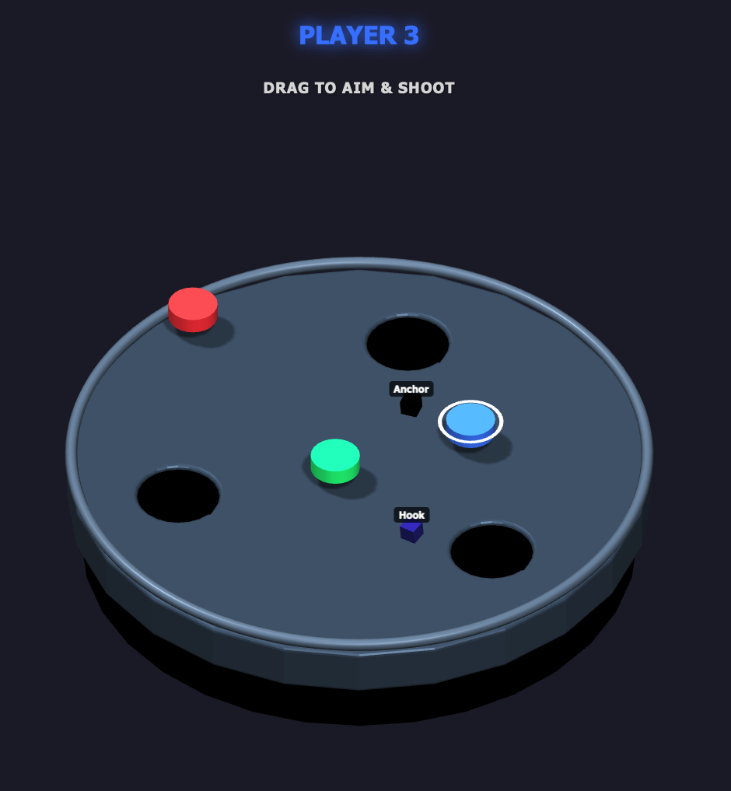
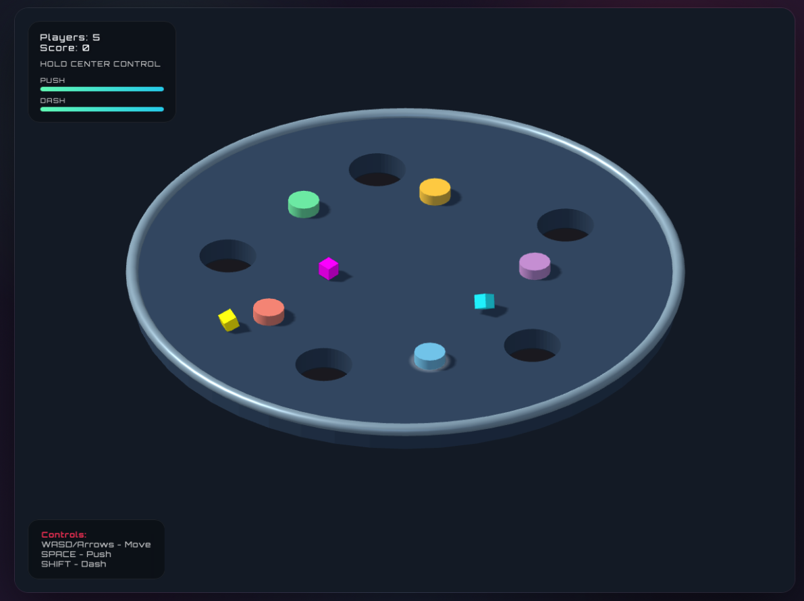
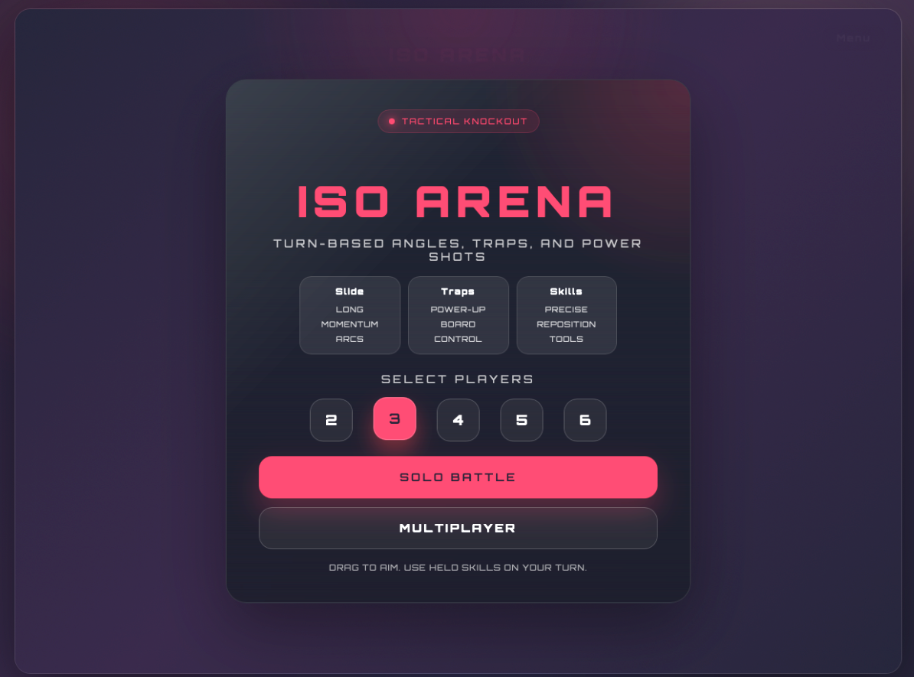
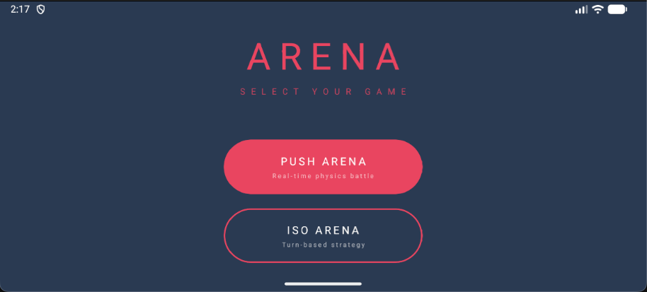
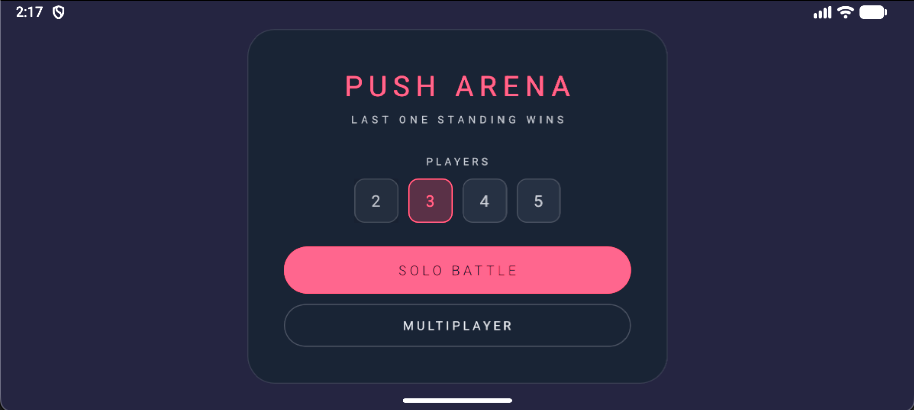
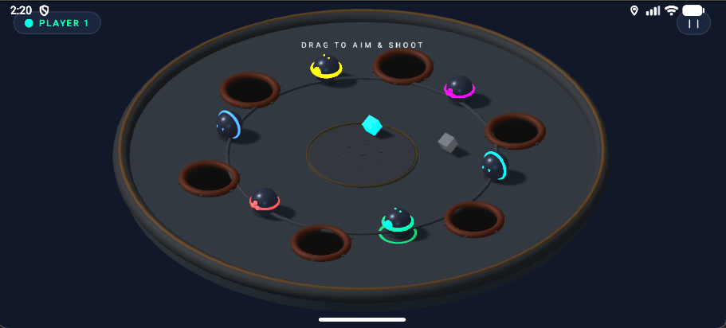
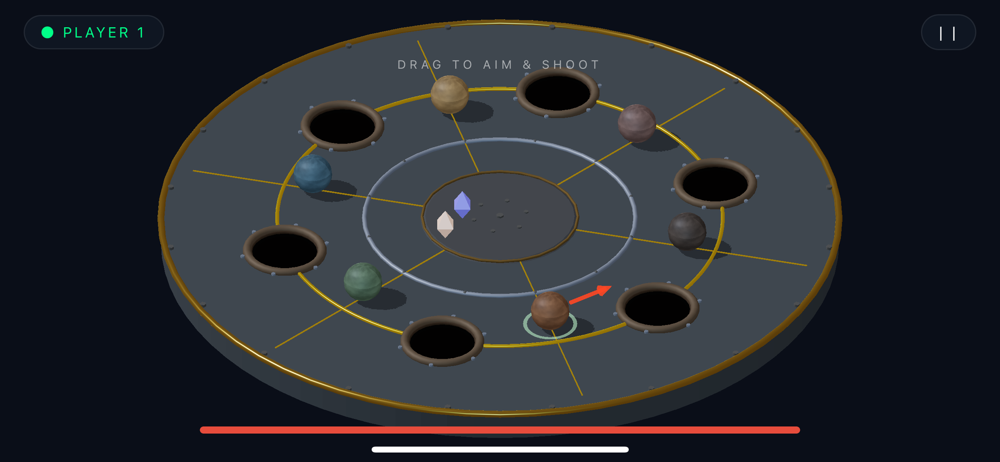
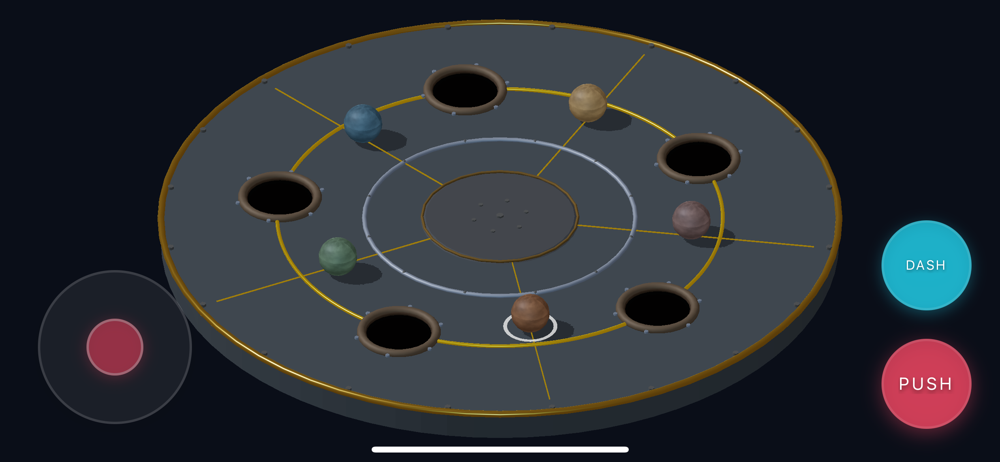

# `ARENA`

**From a notebook sketch to a real-time 3D mobile game — the full development story**

 

An arena-based multiplayer fighting game where players push each other into holes, collect power-ups, and try to be the last one standing. Built from scratch — first as a browser prototype, then rebuilt as a native mobile app.

 

  

*This is the showcase repository — a visual timeline of how the game was made.*
*The development repo is private for now.*

 

---

 

## `What Is Arena?`

**Arena** is a fast-paced physics-based game. You control a player on a circular arena full of holes. Your goal: push everyone else into those holes using dash attacks and power-ups, while avoiding falling in yourself.

The game has two modes:

- **Push Arena** — Free-for-all chaos. Push opponents into holes. Pick up perks like Speed Boost, Mega Push, Shield, Invincible, and Magnet. Last player standing wins.
- **Iso Arena** — A more strategic turn-based variant with puck mechanics and a different camera angle.

You play against AI bots right now, but the multiplayer architecture (WebRTC peer-to-peer) is already built and working on the web version.

 

---

 

## `The Development Story`

This section tells the journey chronologically — from the first rough idea to the current mobile version. Each step shows what changed, what was learned, and what mistakes led to the next improvement.

 

---

### `Stage 01` — The Sketch

**Every game starts somewhere.**

This was it. A rough sketch on paper — a circular arena, some holes around the edge, players in the middle.

There was no code yet, no engine, no tech decisions. Just an idea: *"what if you had to push other players into holes?"*

Looking back, the sketch was surprisingly close to what the game became. The circular shape, the hole placement around the perimeter, the center hub — all of that survived into the final version. Sketching first saved a lot of aimless coding later.

 

---

### `Stage 02` — First Concept Trial

**Does this actually work?**

The first real attempt to see if the idea had legs. Still extremely rough — no real physics, no polish, just shapes on a screen.

But this answered the most important question: **does the core loop feel fun?** Moving around an arena and trying to knock things into holes — does that have any pull?

It did. That was enough to keep going.

**Lesson learned:** Some ideas feel great in your head but fall apart the moment you actually try them. Testing the concept early, even ugly, filters out the dead ends fast.

 

---

### `Stage 03` — First 3D Web Version

**It suddenly felt like a real game.**

This was the turning point. Moving from flat concept to a 3D browser game made everything click. You could see the arena from above, watch players move, and feel the physics.

The browser was chosen deliberately — no app store, no build tools, no compile step. Just open a file and play. That speed of iteration mattered more than anything else at this stage.

**Mistake made here:** The first version used neon-heavy visuals with glowing lines everywhere. It looked "cool" at first but quickly became hard to read during gameplay. Visual noise is not good design. This got fixed later.

**Tech that made this possible:**

| What | Why |
|------|-----|
| Three.js | 3D rendering in the browser — no Unity, no downloads, just WebGL |
| Matter.js | 2D physics engine for collisions, pushing, and hole detection |
| Vanilla JS | No framework overhead, just raw game loop control |

 

---

### `Stage 04` — Web UI Gets Serious

Once the gameplay worked, the next problem became obvious: **the game looked like a prototype**.

The UI was confusing, the menus were afterthoughts, and nothing felt intentional. This stage was about making the game look like something you'd actually want to play — not just something a developer was testing.

The lobby system, game mode selection, and visual hierarchy all got redesigned. The arena itself evolved too — from flat neon lines to a chunky **rustic industrial** style with iron plates, bolt studs, golden rim accents, and dark metal collars around every hole. Each hole now has a physical depth shaft instead of just a colored circle.

> **Key realization:** A game isn't just mechanics. If people can't instantly read what's happening on screen, the feel breaks — even when the physics are perfect underneath.

 

---

### `Stage 05` — Going Mobile: First Menus

This is where the real challenge started. Moving to mobile wasn't a "resize the browser window" situation. It meant rebuilding the entire rendering pipeline, input system, and navigation from the ground up.

The game engine had to be rewritten in TypeScript. The 3D rendering had to go through `expo-gl` (OpenGL ES on the phone's GPU) instead of browser WebGL. Touch controls had to replace keyboard input — a virtual joystick for movement, dedicated buttons for push and dash.

**The first mobile menus looked rough.** But they worked. And they proved the core game could run at playable frame rates on a real phone.

**Tech stack for mobile:**

| What | Why |
|------|-----|
| React Native + Expo | Cross-platform native app without writing Swift/Kotlin separately |
| expo-gl + expo-three | Bridge between Three.js and the phone's native OpenGL context |
| Matter.js | Same physics engine — reused from the web version |
| TypeScript | Type safety across a growing codebase with complex game state |
| React Navigation | Screen flow between menus, lobby, and game modes |

 

---

### `Stage 06` — The Graphics Search

**Finding the right look.**

This was the messy middle of development. The game worked, but it didn't look *right* yet on mobile.

A lot of time went into trial and error here — different arena materials, lighting setups, player model styles. The original cylinder player models got replaced with **procedural robot ball models** (sphere body, accent ring, glowing lens, side panels). Each player got unique ornament themes like Cyclops, Tri-Eye, and Armored.

The arena aesthetic shifted from neon to a grounded **rustic industrial** look — worn iron plates, bolted seams, raised metal collars around holes, golden divider lines between sectors.

**Biggest lesson here:** Graphics iteration feels slow and unproductive compared to adding features. But it's what makes people actually *want* to play your game.

 

---

### `Stage 07` — Current Mobile MVP

**This is where the game is today.**

It runs on real phones. The arena looks intentional. The physics feel responsive. The touch controls work. The AI opponents put up a real fight. And the visual identity — the dark industrial arena with golden accents, glowing perks floating above the surface, robot ball players casting shadows on worn iron — finally feels coherent.

**What's in the current build:**

- Two game modes — Push Arena (free-for-all) and Iso Arena (turn-based strategic)
- AI opponents with configurable difficulty and behavior patterns
- Perk system — Speed Boost, Mega Push, Shield, Invincible, Magnet
- Touch controls — virtual joystick + action buttons with cooldown feedback
- Procedural 3D arena with rustic industrial aesthetic
- Player models with unique themed ornaments
- Multiplayer architecture (WebRTC/PeerJS) built and working on web

 

---

 

## `Under the Hood`

The game isn't built on a commercial engine. Everything from the physics loop to the arena geometry is hand-wired. Here's why the tech choices matter:

| Layer | Tech | Why This Choice |
|-------|------|-----------------|
| **3D Rendering** | Three.js / expo-three | Lightweight enough for mobile GPU. No asset pipeline needed — all geometry is procedural. |
| **Physics** | Matter.js | 2D physics projected into 3D space. Simpler than a full 3D physics engine, and the arena's top-down gameplay doesn't need the Z-axis for collisions. |
| **Mobile App** | React Native + Expo | Single codebase for iOS and Android. Expo handles native modules (GL context, screen orientation, fonts) without manual linking. |
| **Multiplayer** | WebRTC via PeerJS | Peer-to-peer — no game server needed. Players connect directly for lowest possible latency. |
| **Language** | TypeScript | Type safety across 30+ game files with shared state, physics bodies, and Three.js objects. |

### Why It Performs Well on Mobile

Mobile performance was a real battle. Early versions stuttered badly. Here's what was done to fix it:

- **Geometry merging** — Complex player models use shared geometry instances instead of creating new ones per frame
- **Object pooling** — Particles, perks, and effects reuse pre-allocated objects instead of creating garbage for the GC to clean up
- **Capped particle counts** — Hard limit of 150 particles on mobile (down from 250 on web)
- **Shared materials** — Bolt heads, arena segments, and repeated geometry all reference the same material instances
- **Disposal helpers** — Every Three.js object has explicit cleanup to prevent GPU memory leaks
- **React bridge optimization** — Game state updates are batched to avoid flooding the React Native bridge with re-renders

None of this is overengineering. The arena is a controlled, compact space — so the optimization strategy is about being disciplined with the small things rather than building a massive engine.

 

---

 

## `What Was Learned Along the Way`

Building this game taught real lessons — not from tutorials, but from hitting walls and figuring a way through.

| Lesson | How It Was Learned |
|--------|-------------------|
| **Sketch before you code** | The paper sketch saved weeks of building the wrong thing |
| **Ugly prototypes are more valuable than pretty plans** | The first concept trial looked terrible but proved the idea had potential |
| **Neon does not equal good game visuals** | The early glowing line aesthetic looked flashy but made gameplay unreadable |
| **Mobile is a different platform, not a smaller screen** | Touch controls, memory limits, and GPU constraints required a full rethink |
| **Physics tuning is game design** | Push force, dash cooldown, max speed — changing these by small amounts completely changed how the game felt |
| **Mistakes are just earlier versions** | The neon arena to rustic arena transition only happened because the first approach failed |
| **Graphics polish isn't optional** | Players judge a game in the first 2 seconds. The visual overhaul is what made the game presentable |

 

---

 

## `Project Status`

**Arena is still in active development.** It's not finished — but it's reached a point where showing it publicly makes sense.

This is the MVP / prototype phase. The game is:

- Playable on real devices
- Visually coherent (not placeholder art)
- Architecturally structured enough to keep building on
- Open for feedback, ideas, and contributions

### What's Next

- Bringing the WebRTC multiplayer to mobile (currently web-only)
- More game modes and arena variations
- Scoring, progression, and match history
- App store preparation and beta testing
- Continued visual polish and new player model themes

 

---

 

## `Open for Contributions`

If any of this interests you — whether it's gameplay ideas, UI/UX feedback, physics tuning, performance suggestions, or just testing and reporting bugs — this project is open for it.

The game was built solo so far, learning by doing. Outside perspectives would be valuable at this stage.

 

---

   

  **`ARENA`**

  *From sketch — concept — browser prototype — mobile MVP*

  *Still going.*

   

